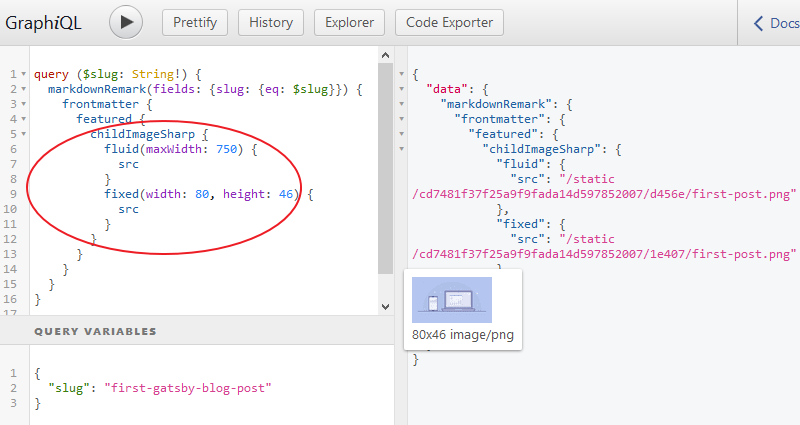
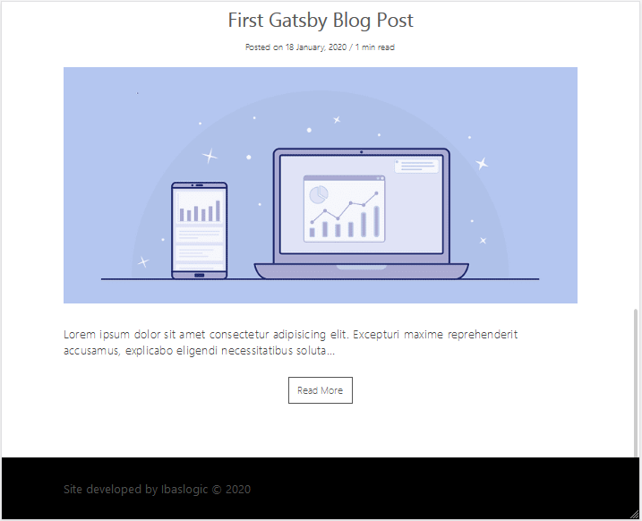

Up to this moment in [our Gatsby tutorial series](/gatsby-tutorial-from-scratch-for-beginners/ "Gatsby tutorial"), we covered how to set up a working blog site where the post data is coming from the Markdown filesystem. If you missed anything, [take a look at the previous section](/sourcing-data-in-gatsby/ "Gatsby data").

Moving forward, in this part, you will learn how to start working with images in your Gatsby site.

If you have ever managed a website blog, you’ll agree with me that a major routine to speed up your site speed is to optimize your images before uploading. We do this by using different editing tools to retouch, crop and resize the images or simply use plugins if you are using WordPress.

These procedure has always been a major pain.

With Gatsby, working with images is a lot easier, you don’t have to require a third-party service to perform image optimization. It has the feature built-in.

So let’s see how it works.

In a Gatsby blog post, you can add images in multiple ways. Aside from including images in the Markdown body, you may want to include a featured image that appears at the top of a post.

Here, you will learn how to do both.

## Adding Images to Markdown Body

We will start by adding an image to our post using the default Markdown syntax. So update your gatsby post to include this syntax and check the frontend.

```

```

Like so:

```md{12}
---
title: "First Gatsby Blog Post"
date: "2020-01-18"
---

Lorem ipsum dolor sit amet consectetur adipisicing elit.

## Excepturi maxime

reprehenderit accusamus, explicabo eligendi necessitatibus soluta!


Ipsam mollitia alias temporibus dicta

1. omnis earum nobis
2. architecto, quia
3. officiis aperiam
4. voluptate quaerat
```

> **Note:** Make sure you add an image named `gatsby-tutorial.png` in the `src/images` folder.

In the frontend, you will see the image `alt` text (gatsby tutorial) being displayed instead of the actual image.

By default, Gatsby doesn’t know where to fetch images. To provide support for this, we will install a couple of plugins. So head over to the terminal and stop the development server.

Then run:

```
C:\Users\Your Name\ ibaslogic-gatsby-tutorial > npm install gatsby-remark-images gatsby-plugin-sharp
```

The `gatsby-remark-images` allows us to use images in our markdown post and add some sort of optimization (responsiveness, multiple versions at different width etc) while the `gatsby-plugin-sharp` is responsible for reducing the size of the images.

Next, go inside the `gatsby-config.js` file and add these plugins.

```js{11-25}
module.exports = {
  siteMetadata: { ... },
  plugins: [
    "gatsby-plugin-sass",
    {
      resolve: "gatsby-source-filesystem",
      options: {
        ...
      },
    },
    "gatsby-plugin-sharp",
    {
      resolve: "gatsby-transformer-remark",
      options: {
        plugins: [
          {
            resolve: "gatsby-remark-images",
            options: {
              maxWidth: 750,
              linkImagesToOriginal: false,
            },
          },
        ],
      },
    },
  ],
}
```

Save the file and run the development server. You should see the image appear in the single post page.

> **Note:** We updated the `gatsby-config.js` file by adding the `gatsby-remark-images` within the `plugins` option of the `gatsby-transformer-remark`.

This image is an optimized version of what you added. It is responsive, compressed and has a lazy-load effect.

Next up,

## Adding Featured Images

Featured images are usually placed within the frontmatter section of your Markdown file. So, add a field called `featured` to your post frontmatter like so:

```
---
title: "First Gatsby Blog Post"
date: "2020-01-18"
featured: "../images/first-post.png"
---
```

> **Note:** Make sure you add an image named `first-post.png` in the `src/images` folder.

To query this featured image for use, you’ll need to install the following plugins.

```
C:\Users\Your Name\ ibaslogic-gatsby-tutorial > npm install gatsby-image gatsby-transformer-sharp
```

The `gatsby-image` is a React component that allows us to render an optimized image (for both fixed and full-width images) through ``. While `gatsby-transformer-sharp` will expose the node, `childImageSharp`, for processing your images.

Once the plugins are installed, add the `gatsby-transformer-sharp` plugin to your `gatsby-config.js` file.

```js{7}
plugins: [
  ...
  {
    resolve: "gatsby-source-filesystem",
    ...
  },
  "gatsby-transformer-sharp",
  ...
],
```

Save the file and start your development server.

Next, let’s see how to query this image from GraphiQL IDE. From the **Explorer** panel, you will notice that a new node called `childImageSharp` is added to the `featured` frontmatter. From there, you can specify the type of image optimization you want (either fixed or fluid).



Notice we are rendering both the fixed and fluid type to show you how both works. You will use fluid for images that stretch the full width of a container. For fixed width and height images, you will use fixed.

Now that we have the data, let’s use the query in our template file and pass the returned data into the `Img` component that `gatsby-image` provides.

In the `src/templates/blog-post.js` file, update the query so you have:

```js{7-13}
export const query = graphql`
  query($slug: String!) {
    markdownRemark(fields: { slug: { eq: $slug } }) {
      frontmatter {
        title
        date(formatString: "DD MMMM, YYYY")
        featured {
          childImageSharp {
            fluid(maxWidth: 750) {
              ...GatsbyImageSharpFluid
            }
          }
        }
      }
      timeToRead
      html
    }
  }
`
```

Still in the template, import the `Img` component from `gatsby-image` module like so:

```js
import Img from "gatsby-image"
```

Then you’ll pass the returned data from the `fluid` object in your query through the `fluid` prop. So add the following just below the span element in the JSX.

```jsx
{
  props.data.markdownRemark.frontmatter.featured && (
    
  )
}
```

This code checks if you have a featured image in your post frontmatter or not. Here, we are using the JavaScript truthy and falsy.

_This is how it works_.

If the operand before the `&&` is truthy i.e there is featured image, the second operand (the `` component) is returned. Else, it is ignored.

Save the file. You should see the featured image rendered in the single post page.

> In the query, you’ll notice that we replaced the `src` with `GatsbyImageSharpFluid`. This is a query fragment used to return the image parameters like the `src`, `srcSet` etc. Query fragments are not supported yet in the GraphiQL IDE. Hence, we simply used `src`.

## Adding Thumbnail to Posts in the Post Listing Page (Blog Page)

This should be a piece of cake. All you have to do is to replicate the above method. In the `src/pages/blog.js` file, update the query frontmatter field so you have:

```js{4-10}
frontmatter {
  title
  date(formatString: "DD MMMM, YYYY")
  featured {
    childImageSharp {
      fluid(maxWidth: 750) {
        ...GatsbyImageSharpFluid
      }
    }
  }
}
```

After that, import the `Img` component from `gatsby-image` module like so:

```js
import Img from "gatsby-image"
```

Then add the following just above the **excerpt** in the JSX.

```jsx
{
  edge.node.frontmatter.featured && (
    
  )
}
```

Save the file and check the blog page. You should see the thumbnail displayed.

Before we go ahead and add more styles to our Gatsby site. Let’s update the other Markdown post to include a featured image. All you have to do is add a field called `featured` in the `frontmatter` pointing to your image.

```
---
title: "Second Gatsby Blog Post"
date: "2020-01-19"
featured: "../images/second-post.png"
---
```

That’s all.

Save the file and see the image rendered in the frontend. Now, we have a fully working blog in our Gatsby site.

Let’s go ahead and add a beautiful look and feel. Here, we will continue with the CSS Module we started earlier. [Please revisit the earlier explanation](/styling-in-gatsby/ "Gatsby tutorial") if you find yourself scratching your head.

Starting with the blog listing page.

Go inside the `src/pages` directory and create a new file called `blog.module.scss`. Then, add the following styles:

```scss
.posts {
  list-style-type: none;
  margin: 0;
  padding: 0;
}
.post {
  padding-bottom: 40px;
  &:last-child {
    padding-bottom: 0;
  }
  h2 {
    font-size: 27px;
    margin: 0 0 10px;
    text-align: center;
    a {
      color: #555;
      &:hover {
        color: #222;
      }
    }
  }
}
.meta {
  font-size: 13px;
  text-align: center;
  font-weight: 300;
  margin-bottom: 20px;
}
.featured {
  max-height: 330px;
}
.excerpt {
  margin: 30px 0 15px;
  font-weight: 300;
  letter-spacing: 0.02em;
}
.button {
  font-size: 14px;
  font-weight: 300;
  text-align: center;
  padding: 20px 0;
  a {
    color: #555;
    padding: 8px 12px;
    border: 1px solid #555;
    &:hover {
      color: #fff;
      border-color: #222;
      background-color: #222;
    }
  }
}
```

After that, go inside the `src/pages/blog.js` file and import the `.scss` file like so:

```js
import blogStyles from "./blog.module.scss"
```

Then, update the markup within the `return` statement to include the class names.

```jsx
return (
  <Layout>
    <ul className={blogStyles.posts}>
      {data.allMarkdownRemark.edges.map(edge => {
        return (
          <li className={blogStyles.post} key={edge.node.id}>
            <h2>
              <Link to={`/blog/${edge.node.fields.slug}/`}>
                {edge.node.frontmatter.title}
              </Link>
            </h2>
            <div className={blogStyles.meta}>
              <span>
                Posted on {edge.node.frontmatter.date} <span> / </span>{" "}
                {edge.node.timeToRead} min read
              </span>
            </div>
            {edge.node.frontmatter.featured && (
              
            )}
            <p className={blogStyles.excerpt}>{edge.node.excerpt}</p>
            <div className={blogStyles.button}>
              <Link to={`/blog/${edge.node.fields.slug}/`}>Read More</Link>
            </div>
          </li>
        )
      })}
    </ul>
  </Layout>
)
```

Save your files and check the blog page.



Beautiful!

In the same way, let’s style the single post page. Go inside the `src/templates` directory and create a new file called `blogPost.module.scss`. Then, add the following styles:

```scss
.content {
  h1 {
    font-size: 35px;
    margin: 0 0 10px;
    text-align: center;
  }
}
.meta {
  font-size: 13px;
  display: block;
  text-align: center;
  font-weight: 300;
  margin-bottom: 20px;
}
.featured {
  max-height: 330px;
  margin-bottom: 25px;
}
```

After that, go inside the `src/templates/blog-post.js` file and import the `.scss` file like so:

```js
import postStyles from "./blogPost.module.scss"
```

Then, update the markup within the `return` statement to include the class names.

```jsx
return (
  <Layout>
    <div className={postStyles.content}>
      <h1>{props.data.markdownRemark.frontmatter.title}</h1>
      <span className={postStyles.meta}>
        Posted on {props.data.markdownRemark.frontmatter.date} <span> / </span>{" "}
        {props.data.markdownRemark.timeToRead} min read
      </span>

      {props.data.markdownRemark.frontmatter.featured && (
        
      )}

      <div
        dangerouslySetInnerHTML={{ __html: props.data.markdownRemark.html }}
      ></div>
    </div>
  </Layout>
)
```

Save your files.

You should see the styles applied in the single post page.

<PostNextUnit heading="Next part: Adding Page Metadata and 404 Error Page" btnLabel="continue" url="/page-metadata-and-404-error-page/" />
