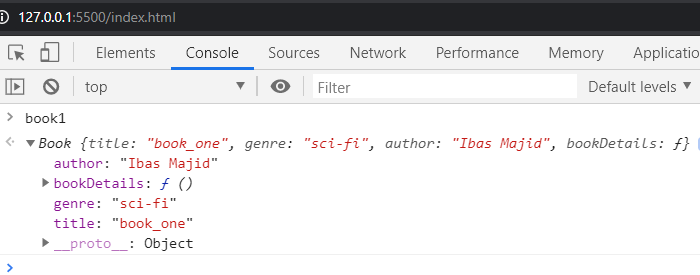
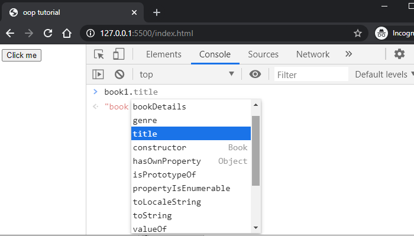
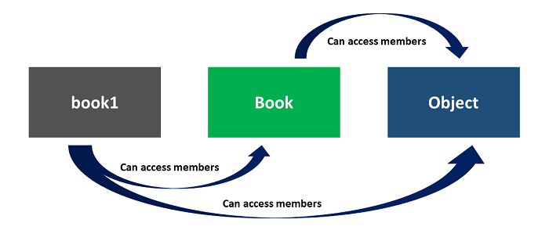
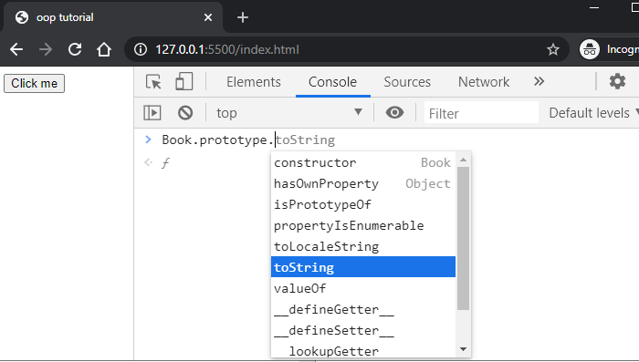
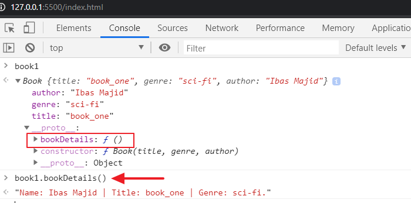
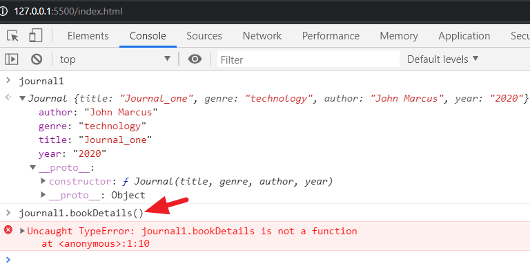
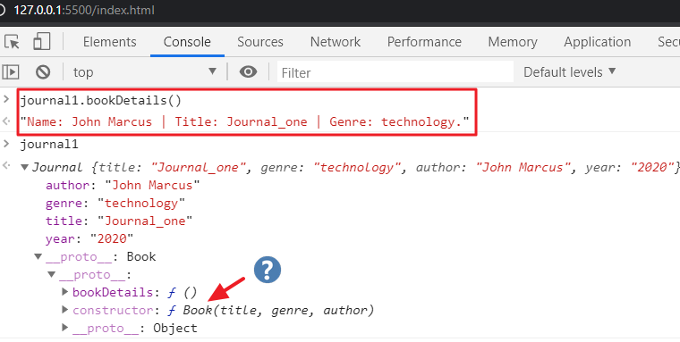
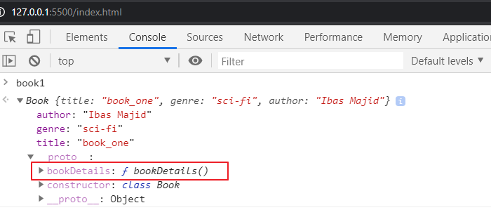
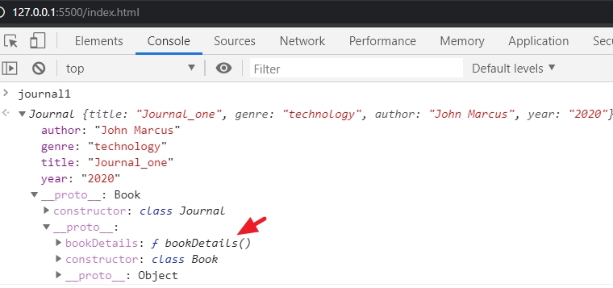

In JavaScript and every other programming language, there are different ways you can write and organize your code. It can be procedural, functional, object-oriented etc.

These are called the **programming paradigm**.

Knowing these major styles of programming is an essential skill for every developer. You’ll always come in contact with them either you are working on your project or some other existing once.

In the procedural style, for instance, we organize code in terms of procedure or task. This is an easy style of writing and you’ve most likely written one.

Let’s take a look at the following code:

```js
const btn = document.querySelector("button")

function displayButtonText() {
  console.log(`This is the text in the clicked button: ${btn.innerText}`)
}

btn.addEventListener("click", displayButtonText)
```

Here, we are splitting the code instructions into procedures. Likewise, the data and the function that operates on them are separated from one another – i.e they are decoupled.

> To see the code in action, you can create a simple HTML file and add a `button` element. Add the above code to a linked `.js` file. Then look up the console of your browser to see the message on click.

Ok.

This is not the approach of the object-oriented JavaScript. It aims at using the object to implement real-life entities (which helps us easily achieve modularity) instead of thinking in terms of individual variables and function.

In this OOP tutorial, we will take a look at this style of programming in JavaScript.
We cover the object fundamentals, OOPS concepts, the ES5 constructor function, the prototype concept, inheritance and the ES6 class syntax.

Let’s get started!

## What Is Object-Oriented Programming (OOP)?

As the name implies, it is a style of programming that is centered around object instead of function. If we take the code above and re-write it in OOP way, you will have something like this:

```js
class DisplayButtonText {
  constructor() {
    this.btn = document.querySelector("button")
    this.btn.addEventListener("click", this.buttonClick.bind(this))
  }

  buttonClick() {
    console.log(`This is the text in the clicked button: ${this.btn.innerText}`)
  }
}

let myButton = new DisplayButtonText()
```

"But…. I just read that OOP is centered around an object. Why am I seeing `class` in the code above? Again, what is `this` and `new` that I'm seeing?"

Don’t worry about them for now, we will take it from the ground up.

Keep reading!

## A Quick Look at JavaScript Object

An object is a collection of name/value pair called object members. Each of these members can either be a property or method depending on their respective types.

If the value of an object member is a function, it is referred to as the object’s **method**. Otherwise, it is an object’s **property** (this hold any value types/primitives or other objects including an array).

> The property is the data associated with the object while the method is an action that can be performed on the object.

Let’s see this in practice.

### Creating Objects in JavaScript

The simplest way to create an object is through the structure below:

```js
const book = {}
```

This is called **object literal**.

From there, you can add a collection of name/value pairs inside like so:

```js
// object literal
const book = {
  title: "book_one",
  genre: "sci-fi",
  author: "Ibas Majid",
  bookDetails: function() {
    return `Name: ${this.author} | Title: ${this.title} | Genre: ${this.genre}.`
  },
}
```

At this point, we have access to the member’s values. And we can get them using the **dot** notation or **bracket** notation.

For the object’s properties, we use either of the dot or bracket notation. But the object’s method can only be accessed using the dot notation.

If you update your code with the following and then check the console, you should see your information.

```js
console.log(book.title) // book_one
console.log(book["genre"]) // sci-fi
console.log(book.bookDetails()) // Name: Ibas Majid | Title: book_one | Genre: sci-fi.
```

Just as we were able to have access to the member’s value, we can also set values using the dot or bracket notation. You will see that later in this guide.

### What Exactly Is “this”?

`this` is a keyword that simply refers to the object it belongs to. In our `book` object, `this` keyword is present in its method. Therefore, it refers to the `book` object that owns the method.

The keyword could also reference the global object (i.e window) or even undefined depending on where it is being called.

> Tips: Always `console.log` the `this` keyword anywhere you want to use it if you are not sure what it references.

If we revisit the `DisplayButtonText` class earlier in our code, we also have `this` keyword. Let’s take a look at its behavior for more understanding.

Normally, we can create an object instance from a class with the `new` operator (we will get to this later). Now, this keyword in the class constructor would reference the current instance of the class. In the code, `myButton` variable.

If you log `this` in the constructor and also log the `myButton` variable after the instantiation at the bottom, you’ll see that they point to the same thing.

That is fine.

But an issue arises in the event handler function. This is because `this` in the handler is bound to the element on which the listener is placed. In this case, the `button` element.

That is the default behavior.

To override it, we used the ES5 `bind()` method. This ensures that the value of `this` point to the class instance just like the other `this` in the class constructor.

To see a clearer picture, let’s log `this` keyword in the handler method and click on the button.

```js
buttonClick() {
  console.log(this); // DisplayButtonText {btn: button}
  ...
}
```

If you check the console, you’ll see that `this` point to the class instance.

But if you temporarily remove the `bind(this)` method from the event listener and click the button once again, `this` keyword in the handler method will point to the `button` element.

```js
class DisplayButtonText {
  constructor() {
    ...
    this.btn.addEventListener("click", this.buttonClick);
  }

  buttonClick() {
    console.log(this); // <button>Click me</button>
    ...
  }
}
```

Another way you can have `this` keyword point to the correct object without the `bind()` method is to modify the handler to use the ES6 arrow function.

```js{7-10}
class DisplayButtonText {
  constructor() {
    ...
    this.btn.addEventListener("click", this.buttonClick);
  }

  buttonClick = () => {
    console.log(this);
    ...
  };
}
```

This works fine because the `this` inside the arrow function will reference the object instance of the class.

You can read more about the [keyword here](https://developer.mozilla.org/en-US/docs/Web/JavaScript/Reference/Operators/this "mozilla documentation").

Moving on.

Now that you have a basic understanding of the object, let’s briefly discuss the OOPS concepts.

## Object-Oriented Concepts

A program is said to be object-oriented if it has the following core principles – Encapsulation, polymorphism, inheritance and abstraction.

> For easy remembrance, I coined this acronym for you – **EnPIA**

In this section, we will take a brief look at each of them.

**Inheritance** – As the name implies, OOP is telling us that you can have a class that inherit the attributes and behaviors of another class, thereby creating a parent-child relationship.

The parent class is also called _super_ or _base_ while the child class is also called _sub_ or _derived_.

**Polymorphism** – Simply means the condition of occurring in several different forms. In OOP, it means that you can have a method or function which can be presented in multiple forms. Of which you can decide which of the forms get executed based on the object types.

_You will see their implementations later in this guide._

**Abstraction** – This is a way of modelling a real-world object with the most essential features. When you think of Abstraction, the focus is on what the object does rather than how it does it.

Let’s take a look at this analogy:

Imagine a system like a Microwave machine. As a user, when you press any button, it executes a sequence of operations behind the scene. But you don’t need to know about the details of operations. What you are concerned about is that if you press “this and this” button, “this and this” happen.

So as a developer, what Abstraction is telling us is that, when modelling a system or object, you should only reveal the most necessary features. And not the internal implementations.

**Encapsulation** – Literally means enclosing data and information in a unit. In OOP, we can bind data and the methods that operate on them inside a class and restrict the direct access to their state. This allows us to hide the implementation details or state that is not meant to be exposed to the outside world.

I hope it’s clear?

Anyway, just take note of these concepts as you will get to see some of the implementations as you read on.

Back to our book object.

## Creating Multiple Objects

Let’s assume we want to create more than one similar book object. We could simply duplicate the object literal for as many books and modify their values accordingly. But that is not practicable.

So, one way we can achieve our aim is by creating a function.

### Creating Objects Through Function

Start by adding the following code to your `.js` file.

```js
// function
function createBook(title, genre, author) {
  const book = {}
  ;(book.title = title),
    (book.genre = genre),
    (book.author = author),
    (book.bookDetails = function() {
      return `Name: ${book.author} | Title: ${book.title} | Genre: ${book.genre}.`
    })
  return book
}
```

Nothing complex is happening in the code. We created a normal function that accepts our book data as argument. Inside this function, we defined the `book` object and as well returned it.

Earlier, I said we can add object members (i.e properties and methods) to an object literal through the dot or bracket notations. That is what we did in the function. We simply create an empty object and add members to it.

The code above is the same as the following:

```js
function createBook(title, genre, author) {
  const book = {
    title: title,
    genre: genre,
    author: author,
    bookDetails: function() {
      return `Name: ${book.author} | Title: ${book.title} | Genre: ${book.genre}.`
    },
  }
  return book
}
```

Here, we are adding the members directly.

> **Note:** Since we define an object whose name/value pair is the same, you can use shorthand and simply replace with the name. For instance, `title: title` becomes `title`.

At this point, we can create as many objects as we want by calling the function like this:

```js
const book1 = createBook("book_one", "sci-fi", "Ibas Majid")
const book2 = createBook("book_two", "fantasy", "Alice M.")
```

Then, you can call any members on the object using the dot or bracket notation as the case may be.

```js
console.log(book1)
console.log(book2)
console.log(book1["author"])
console.log(book1.bookDetails())
console.log(book2.bookDetails())
```

### Creating Objects Through the Constructor Function

JavaScript provides a more elegant approach to create objects using the constructor function. it emulates the OOP class behavior.

Later in this guide, you will learn how to use the class syntax which is sort of a “syntactic sugar plus extras”. For now, think of this function as a class.

As you may know, a class is simply a blueprint or template to create objects.

Now, to create several books object via the constructor function, we need to first define a blueprint through this function like so:

```js
// Constructor function
function Book(title, genre, author) {
  ;(this.title = title),
    (this.genre = genre),
    (this.author = author),
    (this.bookDetails = function() {
      return `Name: ${this.author} | Title: ${this.title} | Genre: ${this.genre}.`
    })
}
```

> **Note:** By convention, always start the constructor function name with a capital letter.

Using this Book template, we can create actual objects like so:

```js
const book1 = new Book("book_one", "sci-fi", "Ibas Majid")
const book2 = new Book("book_two", "fantasy", "Alice M.")
```

From here, you can call any members on the object using the dot or bracket notation.

What is happening in the code?

Nothing really, the code is similar to that of the object created through the normal function earlier. Well, constructors are also functions as you can see.

But here, we are using `this` to reference the current object instance. In this scenario, when we create the `book1` object, `this` would point to `book1`. The same thing applies to `book2` and any other object instance you create.

### The new Operator

This operator allows us to create a new object instance from our reusable blueprint (in this case, `Book`).

If you look closely, the way we create an object using the normal function is similar to that of the constructor function. Except that in the constructor function, we are not explicitly creating and returning an object.

The `new` operator does that for us behind the scene. It creates an empty object; set this to point to that object and return it.

Let’s take a step further.

If you try entering any of the object instances, `book1` or `book2` into your console, you’ll see something like this:



While it works, we don’t need the `bookDetails()` function in the actual object as seen in the image above. You’ll also find this function for every new instance of the `Book` constructor function. This may cause an issue for memory sensitive applications.

So what is the solution?

That brings us to another important sub-topic.

## The Concept of Prototype in JavaScript

The idea behind the prototype is very simple. It is the logic behind an object inheriting features from another object. We have two distinct prototypes – the object’s prototype and the prototype property.

These are kind of confusing. So you have to read carefully.

You can think of the object’s prototype as a template from which features are inherited. Take for instance, if you type `book1.` – from our last code above – in the console, you’ll see something like this:



We understand where the title, genre, author and the bookDetails are coming. They are members we defined on the `Book()` constructor which are then available to every object instance created from it.

In this case, the `Book()` is the template for `book1` object – in other words, the `Book()` is the `book1` prototype object.

In the same line, the `Book()` constructor function also looks up to a template (which becomes its prototype object) where it inherited members from. That object is the global `Object`. And it holds all the other members you see in the image.

The image below will do justice to the explanation.



This explains that `book1` object inherits members from its constructor, `Book()`. And because the Book’s template/prototype is the global `Object()`, `book1` can also inherit members from the `Object()`.

Now, we know that these inherited members are coming from the constructor function – either the global `Object` or our `Book`.

But where exactly can we find them?

They are defined on the `prototype` property on the constructor functions. If you type `Book.prototype.` or `Object.prototype.` in the console, you’ll see the methods.



With this prototype property, we can add new members to the list of methods to be inherited by object instances. Now, we don’t need to define methods directly in the constructor function.

Let see the implementation.

If you modify the `Book` constructor function to use this `prototype` property, you should have:

```js
function Book(title, genre, author) {
  this.title = title
  this.genre = genre
  this.author = author
}

Book.prototype.bookDetails = function() {
  return `Name: ${this.author} | Title: ${this.title} | Genre: ${this.genre}.`
}

const book1 = new Book("book_one", "sci-fi", "Ibas Majid")
const book2 = new Book("book_two", "fantasy", "Alice M.")
```

As you can see, the `bookDetails()` method is defined on the `prototype` property on the `Book` constructor function.

Save the file and type `book1` in the console.

As seen below, the `bookDetails()` method is now being added to the object’s prototype (`__proto__` property) rather than the actual object. Remember, all instances of the `Book` constructor will have access to that method.



## Inheritance

Now that we have a blueprint – i.e our `Book` constructor. You may want to reuse some of its features in another template. So instead of creating a new template from scratch, you can build on the already existing one.

Let’s see a practical example.

We will create a `Journal` constructor that will accept not only the `title`, `genre`, `author` but also the `year`.

Since our `Book` already has most of these data, the `Journal` can inherit the common features for use alongside its unique feature – i.e the `year`. In this case, the `Book` is the parent constructor while the `Journal` is the child constructor.

Let’s update our code so we have:

```js
// Constructor function
function Book(title, genre, author) {
  // ...
}

Book.prototype.bookDetails = function() {
  // ...
}

function Journal(title, genre, author, year) {
  Book.call(this, title, genre, author)
  this.year = year
}

const journal1 = new Journal("Journal_one", "technology", "John Marcus", "2020")
```

The area of focus is the `Journal` constructor. Here, we are creating the child constructor just like any other constructor. In addition to that, we are calling the properties defined in the parent constructor, `Book()` using the `call()` method.

Mind you, the value of `this` in the `call()` will point to the current object instance created from the `Journal` constructor. At the end of the day, all we are doing in the child constructor is this:

```js
function Journal(title, genre, author, year) {
  this.title = title
  this.genre = genre
  this.author = author
  this.year = year
}
```

If you save your file and type `journal1` in the console, you should see your data:



And if you try to access methods on the parent constructor’s prototype, you’ll get an error as seen in the image.

Most of the time, you’d want to define a new method that will accommodate your new additions (in our case, we added a `year` to the property). We'll come to that in a moment.

For now, let’s see how to inherit the parent methods. Simply add this code below the `Journal` constructor function but above the constructor call.

```js
// inherit Book prototype
Journal.prototype = Object.create(Book.prototype)
```

By using `Object.create()` method, you can create a new object based on any existing object. So in the code above, we simply get the methods on the `Book.prototype` and assigned them to the `prototype` property on the `Journal` constructor.

This way, all instances of the `Journal` constructor can have access. Now, save your file and check if `journal1` can now access the `bookDetails()` method.



It works!

But….

If you type `journal1` and expand it to see it’s constructor, you’ll see that it points to its parent constructor, `Book` instead of `Journal`. This is happening because the `Journal` is inheriting the methods defined in the `prototype` property (which includes the `constructor` function) of the `Book`.

You can simply correct that by adding the following line at the bottom:

```js
// Use Journal constructor
Journal.prototype.constructor = Journal
```

Save your file. Go back to the console and check the constructor once again, it should point to the expected function.

Next, let’s define a new `bookDetails()` method on the `Journal()` constructor to capture its new addition – i.e the `year` property.

That should be a piece of cake!

All we have to do is to add the following code at the bottom:

```js
// Journal Book details
Journal.prototype.bookDetails = function() {
  return `Name: ${this.author} | Title: ${this.title} | Genre: ${this.genre} | Year: ${this.year}.`
}
```

We’ve done something like this earlier.

Now, whenever we invoke or call the `bookDetails()` on the child object – i.e `journal1`, this method overrides that of the parent.

Let’s call this method on the `book1` and `journal1` objects and see what we get.


In the image, the `bookDetails()` method is presented in two different forms. Of which, each of the object instances implements its version of the method. That is **Polymorphism** in action.

## The ES6 Classes

We’ve seen how to create objects by calling a constructor function. Now, you’ll learn a modern way of doing the same thing using the `class` syntax – which provides a much easier way.

Besides, we cover how to implement inheritance using this syntax. Let’s start with a simple class definition:

```js
class Book {
  constructor(...) {
    // properties assigned here
  }

  // other methods here...
}
```

Here, we are using the ES6 `class` keyword to generate a template from which we can create our object. This `class` will hold your methods alongside the `constructor` – where you can assign properties.

If we reconstruct our `Book` function from the prototype-based constructor, you will have:

```js
class Book {
  constructor(title, genre, author) {
    this.title = title
    this.genre = genre
    this.author = author
  }
  bookDetails() {
    return `Name: ${this.author} | Title: ${this.title} | Genre: ${this.genre}.`
  }
}

const book1 = new Book("book_one", "sci-fi", "Ibas Majid")
```

As you can see, the code is neat and easier to write. But behind the scene, this `class` create a function called `Book` just as we’ve seen earlier with the constructor function. Then, it takes the properties from the `class` constructor and also stores the `bookDetails()` method in the `prototype`.

If you save the file and type `book1` in the console, you’ll have:



As you can see, using the `class` syntax is much easier. You don’t have to call a method on the `prototype` property to have them stored in it.

### Creating Class Inheritance (Subclass or Child Class or Derived Class)

To create a subclass from our existing Book, we will use the `extends` keyword. This tells JavaScript where the child class should inherit from.

If you’ve worked with [React class component](/react-tutorial-for-beginners/ "React tutorial"), you’d often see this keyword.

Let’s reconstruct our `Journal` constructor function (in the prototype-based) to use the `class` syntax.

Simply add the following code after the `Book` class:

```js
// Book sub class
class Journal extends Book {
  constructor(title, genre, author, year) {
    super(title, genre, author)
    this.year = year
  }
}
// instantiate Journal
const journal1 = new Journal("Journal_one", "technology", "John Marcus", "2020")
```

In addition to how we construct classes, we are calling the super/parent constructor (together with its properties) by using the `super()` operator.

If you save your file and type `journal1` in the console, you’ll see your data. And you’ll be able to call the members defined on its class as well as its parent.



Just like we did in the prototype-based, we can also define a new `bookDetails()` method on the `Journal` class to capture the year. So add this in the `Journal` class:

```js
bookDetails() {
  return `Name: ${this.author} | Title: ${this.title} | Genre: ${this.genre} | Year: ${this.year}.`;
}
```

Save your file and test your work. You should be good!

## Conclusion

Having come this far, you have learned a lot about the subject. Now you know how to represent real-world entity using the object.

In addition to understanding this object fundamental, you have also learned the OOP concepts; the constructor function; prototype and inheritance. Furthermore, you learned how to use the ES6 class syntax to write more elegant code.

So, if you like this guide, endeavor to share around the web and follow me for more updates.

[Follow me on Twitter](https://twitter.com/ibaslogic "Ibaslogic Twitter")
