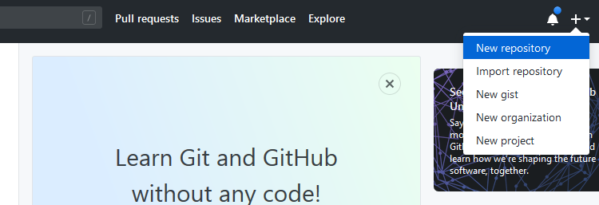
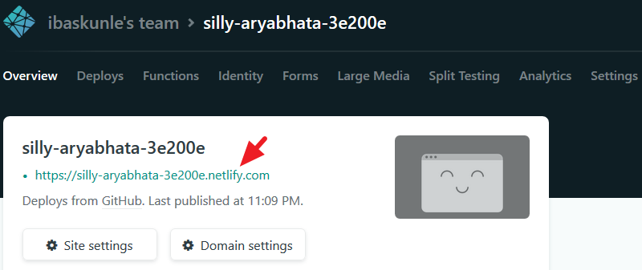
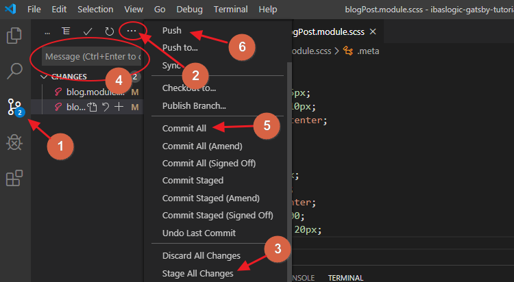

You have come a long way in [developing a beautiful site with Gatsby](/gatsby-tutorial-from-scratch-for-beginners/ "Gatsby tutorial"). Now, it’s time to make it available on the web.

Here, you will learn how to host and deploy your Gatsby site on Netlify for free.

Netlify is a great service for hosting static websites and a very popular choice when working with Gatsby sites. It allows us to push our code to GitHub or any of its other supported repository. It then takes this code and deploys your site.

To get started, [you need a GitHub account](https://github.com/ "GitHub account"). So create one if you don’t have.

Then, we will move all our Gatsby files to GitHub repository. This involves moving the files to the local repository and then to the remote repository.

The first thing you would want to do when setting up a git project is to initialize your local Git repository. This will create a `.git` folder in your project directory.

Fortunately, all Gatsby project already have this Git repository created. Now you just have to make sure that all of your new files actually becomes part of the repository.

You will need a couple of Git commands to achieve this.

## Deploy to a Local Repository

In your terminal, stop your development server and run this command:

```
C:\Users\Your Name\ ibaslogic-gatsby-tutorial > git add .
```

This keeps all your working files in the staging area. To see what’s in the staging area, run this command:

```
C:\Users\Your Name\ ibaslogic-gatsby-tutorial > git status
```

This command checks the current status of the working tree. You should have the files in green if they are in the staging area. Else, you'll have them in red.

Next, commit all the changes with this command:

```
C:\Users\Your Name\ ibaslogic-gatsby-tutorial > git commit -m 'first commit'
```

> **Note:** The commit message is written in the quote. Modify to whatever you like.

At this point, your project files are now in the local repository.

## Deploy to a Remote Repository

Go ahead and log into your GitHub account and create a new repository.



On the new page, you will be required to name your repository. In my case, I will name it **ibaslogic-gatsby-tutorial**. Other fields are optional and self-explanatory.

> Note that Gatsby already included a README.md file in your project folder. So DON'T Initialize this repository with a README.

Next, click on the **Create repository** button. This takes you to a page where you will find the remote URL.

Find the command that looks like this and run it in your terminal:

```
git remote add origin https://github.com/Ibaslogic/ibaslogic-gatsby-tutorial.git
```

If you can’t find it, modify the URL above to reflect your repository. What this command does is to add the repo as the remote repository.

Finally, run this command to push to the master branch:

```
git push -u origin master
```

Now reload your GitHub page. You should have your project files and folders already pushed to your account.

Good.

We are almost done!

## Connecting GitHub Repository to Netlify

Head over to [Netlify website](https://www.netlify.com/ "Netlify site") and signup for a free account. Once you confirm your account and logged in, click on the **New site from Git** button at the top right of the screen.

On the new page, select GitHub as your Git provider under the **Continuous Deployment** section and permit Netlify to use your account.

After that, choose your website repository.

This takes you to the deploy settings page. Leave the default options and click on the **Deploy site** button to start the deployment process.
Once the deployment is complete, you’ll see your site URL.



Visit the URL and see your beautiful site live on the web.

Great!

### Changing the Site Name

Instead of using the name given to you by netlify, you can change it to something that you can easily read. To do that, Head over to the **Settings** tab and click on the **Change site name** button to specify a name. In my case, **ibaslogic-site**.

Make sure you save your changes and visit your new URL. Here, I’ll visit my site at https://ibaslogic-site.netlify.com/.

## Continuous Deployment

Now if you make changes to your site content or code. All you have to do to see your changes in production is to push them to GitHub. Then, Netlify will trigger a new deploy automatically and your changes will be available after a few moments.

If you are on VsCode, you can commit your changes to GitHub without using the terminal. Just follow the labels in the image below.



Click on the Source Control, label 1, to see your pending changes. After that, click on label 2 to bring out more options. Then, stage all your changes. Once that’s done, write your commit message and commit your changes. Finally, push to the remote repository.

And... You're done!

## Conclusion

Congratulations! I’m excited you are here. In this Gatsby tutorial series, you [started by setting up a Gatsby project](/gatsby-tutorial-from-scratch-for-beginners/ "Gatsby tutorial") and learning the fundamentals. From there, you were able to create Gatsby pages and load dynamic content to your site.

You were then introduced to the different ways of styling a Gatsby site. In addition to global styling, we also covered how you can scope your component styles locally using the CSS Modules to avoid the risk of name conflicts with any CSS selector.

After that, you learned how to set up a basic SEO for your Gatsby site. And lastly, in this part of the series, you learned how to deploy your site to Netlify.

If you have any questions, recommendations or additions, let me know through the comment sections. And if you like this Gatsby tutorial, endeavor to share around the web and subscribe for more updates.

View [Project here](https://ibaslogic-site.netlify.com/ "Gatsby project") and [source code here](https://github.com/Ibaslogic/ibaslogic-gatsby-tutorial "Ibaslogic GitHub repo").
