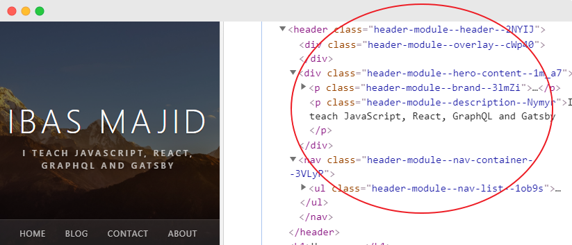
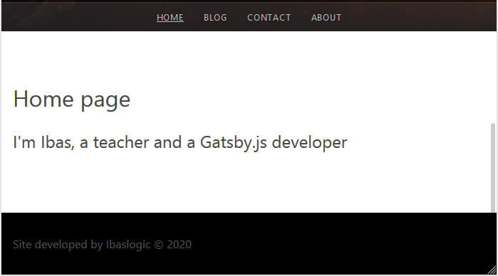

[In the previous section](/gatsby-tutorial-from-scratch-for-beginners/ "Gatsby tutorial"), we've learned some of the Gatsby fundamentals and started developing our Gatsby site.

Now, we have a decent amount of content spread across pages on our site. So, we need to work on the look and feel by adding styles.

In this section, you will learn how to easily style your Gatsby site using CSS.

Along the way, you will also learn how to set up a Gatsby plugin to enable SASS. You will be able to take advantage of all its great features and further customize your site.

> **Note:** If you are not comfortable with SASS, feel free to use the regular CSS styles.

So let’s get started.

Go inside the `src` directory and create a new folder called `styles`. In this folder, create a file called `style.css` and add the following base styles:

```css
* {
  box-sizing: border-box;
}
body {
  color: #464646;
  font-size: 100%;
  margin: 0;
  line-height: 1.4283;
  font-family: "Segoe UI", Roboto, Verdana, "Helvetica Neue", sans-serif;
}
h1,
h2,
h3 {
  font-weight: 400;
}
a {
  color: #f44f18;
  text-decoration: none;
}
```

After that, import the CSS file in the `Layout` component like so:

```jsx
import "../styles/style.css"
```

> The reason for the `Layout` component is that it is used in every pages’ files.

Save your files and see your styles applied in the frontend. That is a great starting point.

You now have a stylesheet loaded in your Gatsby site. You can write all your styles right inside of this single file. But in this tutorial, we are not going to do that.

As I mentioned, we will be using sass to speed up our site customization. This is also a great moment to learn how to integrate sass in a Gatsby project and install your very first Gatsby plugin.

So let’s do that.

## Installing and Configuring gatsby-plugin-sass

As you may have known, website plugins add functionalities to the website. And Gatsby provides a whole lot of plugins built by its team as well as the third-party plugins developed by the members of its community.

You can search for these plugins by [visiting the Gatsby site](https://www.gatsbyjs.org/ "Gatsby site") and navigating to the **Plugins** page.

Now, the sass plugin we will install is called `gatsby-plugin-sass`.

So let’s stop the development server with `CTRL + C` or `CMD + C` depending on your operating system and then run:

```
C:\Users\Your Name\ ibaslogic-gatsby-tutorial > npm install gatsby-plugin-sass node-sass
```

`node-sass` allows us to compile `.scss` files to regular `css`. While `gatsby-plugin-sass` allows us to do that in a Gatsby project.

Once the installation is done, you need to configure your Gatsby site to use the Gatsby plugin. So, open the `gatsby-config.js` file in the root directory and add this:

```js
module.exports = {
  plugins: ["gatsby-plugin-sass"],
}
```

Save the file and start your development server by running `gatsby develop`.

Next, rename the `style.css` file to `style.scss` and update the `import` in the `layout.js` file to reflect the `.scss` extension like so:

```jsx
import "../styles/style.scss"
```

Save your file. You should still have your styles applied in the frontend. Now you can use sass in your project.

Let’s confirm that it’s working by adding sass variables in our `scss` file. Update the file so you have:

```scss{1-3,9,19}
$primaryColor: #464646;
$secondaryColor: #f44f18;
$mainWhite: #fff;

* {
  box-sizing: border-box;
}
body {
  color: $primaryColor;
  font-size: 100%;
  margin: 0;
  line-height: 1.4283;
  font-family: "Segoe UI", Roboto, Verdana, "Helvetica Neue", sans-serif;
}
h1,
h2,
h3 {
  font-weight: 400;
}
a {
  color: $secondaryColor;
  text-decoration: none;
}
```

Save the file. Yeah, it works!

## Styling Gatsby Site with CSS Modules

In order to add some sort of global styles in our Gatsby site, we added a stylesheet in a shared `Layout` component.

Though this stylesheet file can hold all of your site styles, it is recommended to limit this file to your global styles and scope your component styles locally using the CSS Module.

> CSS Modules are supported by default in a Gatsby project and they eliminate the risk of name conflicts with the css selector or some other issues related to the global scope styling.

For instance, if you add a CSS Module for the `Header` component, the styles applied will be scoped only to that component. This way, you can use the same class names in different components without worrying about conflicts with the css selector.

That is what we want.

Starting with the `Header` component.

Let’s go inside the `src/components` directory and create a file called `header.module.scss`. Then, add the following styles:

```scss
.header {
  position: relative;
  height: 326px;
  text-shadow: 0 1px 2px rgba(0, 0, 0, 0.4);
}

.hero-content {
  position: absolute;
  top: 35%;
  margin: 0;
  text-align: center;
  width: 100%;
  text-transform: uppercase;
}

.brand {
  margin: 0;
  padding: 0 0 10px;
  font-size: 48px;
  font-weight: 300;
  line-height: 1.2;
  letter-spacing: 5.5px;

  a {
    color: #fff;
  }
}

.description {
  margin: 0;
  padding: 0 0 10px;
  font-size: 12px;
  font-weight: 500;
  line-height: 1.5;
  letter-spacing: 3.5px;
  opacity: 0.7;
  color: #fff;
}

.nav-container {
  position: absolute;
  bottom: 0;
  left: 0;
  right: 0;
  background: rgba(255, 255, 255, 0.1);
  border-top: 1px solid rgba(255, 255, 255, 0.1);
}

.nav-list {
  margin: 0;
  display: flex;
  flex-flow: wrap;
  justify-content: center;
  padding: 0;
  list-style: none;

  li {
    letter-spacing: 0.05em;
    background: none;
    padding: 7px 14px 10px;
  }

  a {
    text-transform: uppercase;
    color: #fff;
    font-size: 12px;
    opacity: 0.7;

    &:hover {
      text-decoration: underline;
    }
  }
}
```

> Please note that you’ll append `.module.css` to your file name if you are writing in the `.css` file. Also note that we are indenting css selector and the pseudo-class (`:hover`) inside another selector in the `.scss` file. This will not work in a `.css` file.

After that, go inside the `header.js` file and import the `.scss` file like so:

```js
import headerStyles from "./header.module.scss"
```

Then, update the markup within the `return` statement to include the class names:

```jsx{2-4,7,11-12}
return (
  <header className={headerStyles.header}>
    <div className={headerStyles.heroContent}>
      <p className={headerStyles.brand}>
        <Link to="/">Ibas Majid</Link>
      </p>
      <p className={headerStyles.description}>
        I teach JavaScript, React, GraphQL and Gatsby
      </p>
    </div>
    <nav className={headerStyles.navContainer}>
      <ul className={headerStyles.navList}>...</ul>
    </nav>
  </header>
)
```

Save your files and check the frontend.

We need to add a background image to the header section. So go inside the `src` directory and create a folder called `images`. Inside this folder, add a background image and name it `header-image.jpg`.

> Feel free to use any image on your hard drive. Or [check my GitHub repo](https://github.com/Ibaslogic/ibaslogic-gatsby-tutorial/tree/master/src/images "download project image") and download the same header image used in this project.

Then update the `.header` class selector in the `header.module.scss` file so you have:

```scss{5-8}
.header {
  position: relative;
  height: 326px;
  text-shadow: 0 1px 2px rgba(0, 0, 0, 0.4);
  background-position: center center;
  background-repeat: no-repeat;
  background-size: cover;
  background-image: url("../images/header-image.jpg");
}
```

Before you save the file, let’s add an overlay to the background image.

In the `header.js` file, add this `div` immediately after the `<header>` opening tag:

```html
<div className="{headerStyles.overlay}"></div>
```

Then update the `header.module.scss` file to include the following styles:

```scss
.overlay {
  content: "";
  position: absolute;
  top: 0;
  right: 0;
  bottom: 0;
  left: 0;
  background-color: #000;
  opacity: 0.5;
}
```

Now save all your files. Your frontend should look like this:


### So what did we do?

First, we tell Gatsby to process the SCSS file as a CSS module by appending to the file `.module.scss`. This module is then imported in the `header.js` file and declared as a JavaScript object called `headerStyles`.

This object holds all the class selector in the `.scss` file, and we referenced them in the JSX `className` attribute with `headerStyles.classSelector` (for instance, `headerStyles.header`).

> Please note,
>
> You can name the `headerStyles` object anything you want. Also, any selector that has a hyphen ( – ) can be referenced with its camelCase version in the `.js` file. For instance, the `.hero-content` in the `.scss` file turned to `heroContent` when we referenced it in the `className` attribute inside the `.js` file.

If you inspect the `header` element in your browser developer tools, you’ll see that the CSS module generates unique class names as seen in the image below. With this, you don’t have to worry about selector name conflicts.



Before we go ahead and style the other components, let’s style the active navigation menu item. This will tell the site users which page is currently being viewed.

To do this, go inside the `header.js` file and update the `<Link />` components to include the `activeClassName` attribute.

```jsx
<ul className={headerStyles.navList}>
  <li>
    <Link to="/" activeClassName={headerStyles.activeMenuItem}>
      Home
    </Link>
  </li>
  <li>
    <Link to="/blog/" activeClassName={headerStyles.activeMenuItem}>
      Blog
    </Link>
  </li>
  <li>
    <Link to="/contact/" activeClassName={headerStyles.activeMenuItem}>
      Contact
    </Link>
  </li>
  <li>
    <Link to="/about/" activeClassName={headerStyles.activeMenuItem}>
      About
    </Link>
  </li>
</ul>
```

The `activeClassName` attribute gets applied to the `Link` when the current item is active. And as you can see in the code, it’s referencing the `.activeMenuItem` class selector.

So go inside the `header.module.scss` file and add this style:

```scss
.active-menu-item {
  text-decoration: underline;
}
```

Save your files and see the styles applied in the frontend.

Now that you know how the CSS module works, let’s go ahead and add some styling to the body and footer sections. We always want the footer to stay at the bottom of the page. For that, we will set up a sticky footer.

This is very simple!

Update the `layout.js` file so it looks like this:

```jsx{4,8-14}
...

import "../styles/style.scss"
import layoutStyles from "./layout.module.scss"

const Layout = props => {
  return (
    <div className={layoutStyles.container}>
      <div className={layoutStyles.content}>
        <Header />
        <div className={layoutStyles.mainContent}>{props.children}</div>
      </div>
      <Footer />
    </div>
  )
}

...
```

The markup in the `return` statement is a common structure for the sticky footer. Where the header and the main content are placed in a `div` container while the footer is placed outside of it.

You’ll notice we imported a css module file named `layout.module.scss`. So you need to create that file.

In the same `src/components` directory, create a `layout.module.scss` file and add the following:

```scss
.container {
  display: flex;
  flex-direction: column;
  min-height: 100vh;
}

.content {
  flex-grow: 1;
}

.main-content {
  margin: 0 auto;
  max-width: 750px;
  padding: 3rem 1rem 4rem;
}
```

Save the files.

In the same way, update the `footer.js` file so you have:

```jsx{2,6-7}
import React from "react"
import footerStyles from "./footer.module.scss"

const Footer = () => {
  return (
    <footer className={footerStyles.siteFooter}>
      <div className={footerStyles.container}>
        <p>
          Site developed by Ibaslogic &copy;{" "}
          {new Date().getFullYear().toString()}{" "}
        </p>
      </div>
    </footer>
  )
}

export default Footer
```

Then create `footer.module.scss` file in the `components` directory and add the following:

```scss
.site-footer {
  background-color: #000;
  color: #515151;
}
.container {
  margin: 0 auto;
  max-width: 750px;
  padding: 1rem;
}
```

Save your files and check the frontend. Your page should look like this:



Looks good. Now you know how to add styles to your Gatsby site.

Depending on what you want, you can decide to add a global style or locally scope your style to your component. Besides, you also learned how to implement SASS in a Gatsby site.

In the next section, we will start working on getting dynamic data to our site.

<PostNextUnit heading="Next part: Sourcing data in gatsby" btnLabel="continue" url="/sourcing-data-in-gatsby/" />
